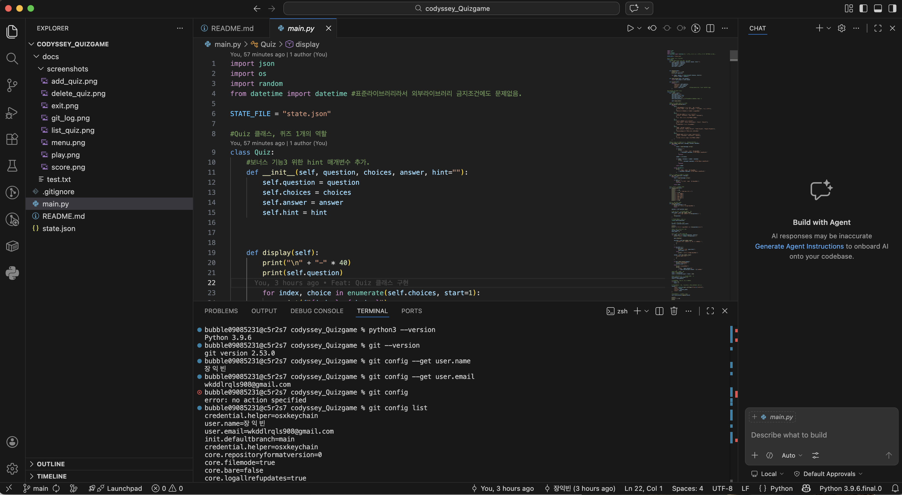
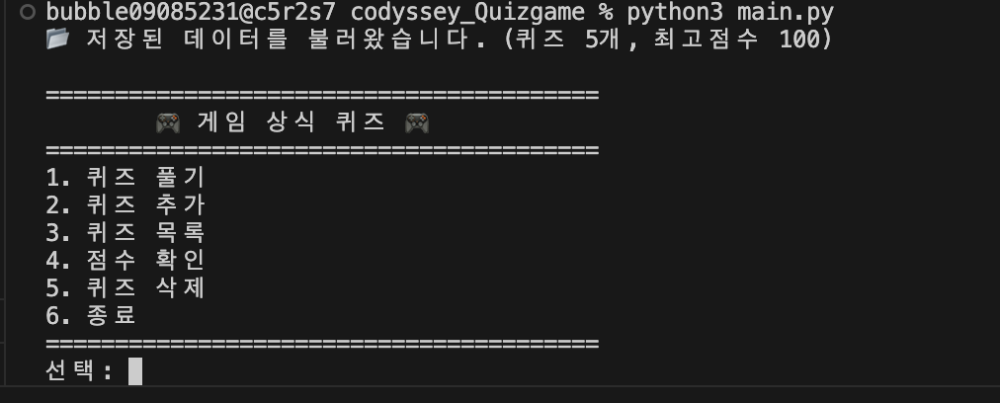
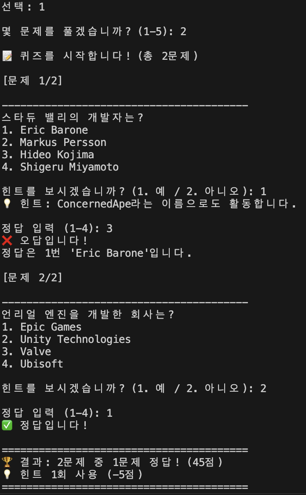
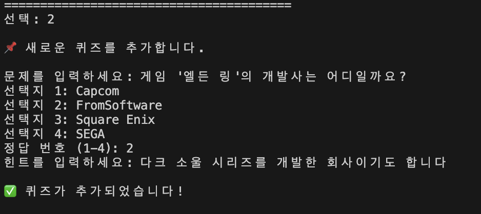
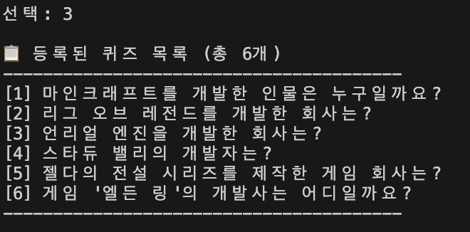
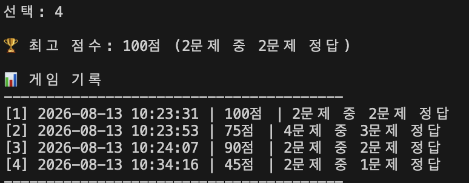
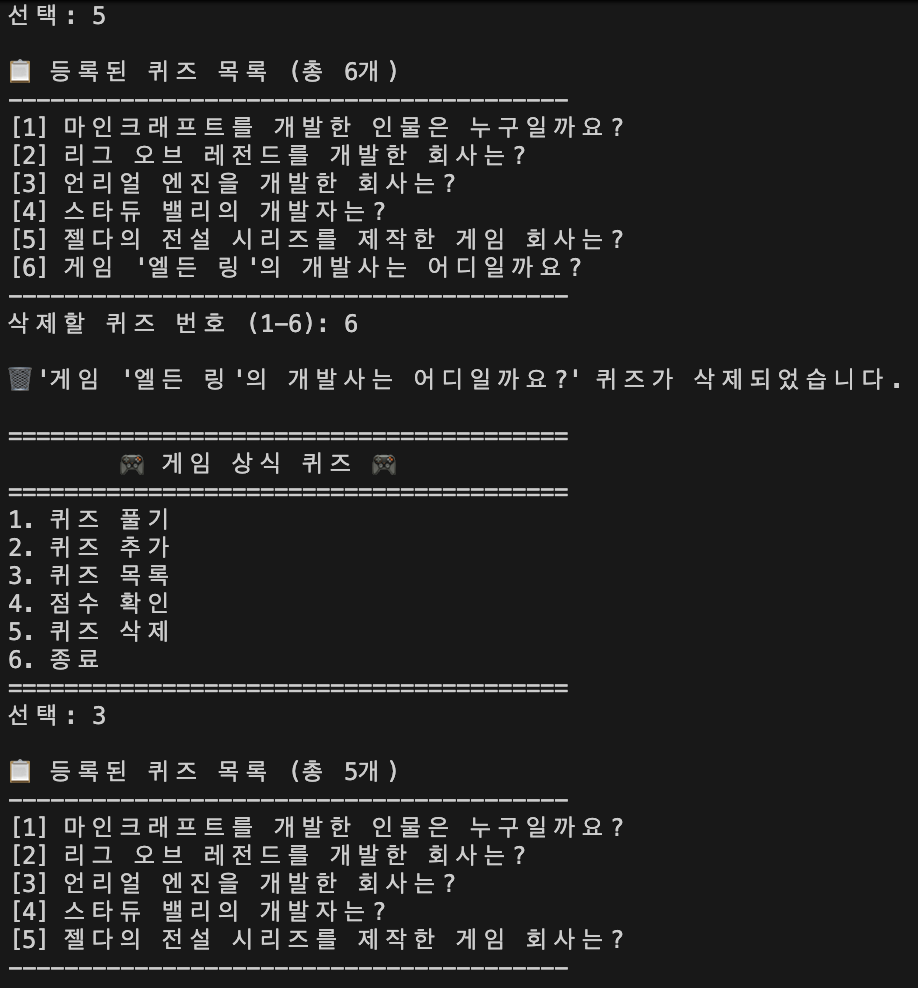
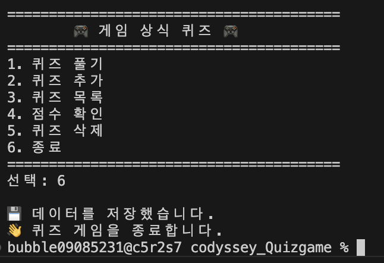
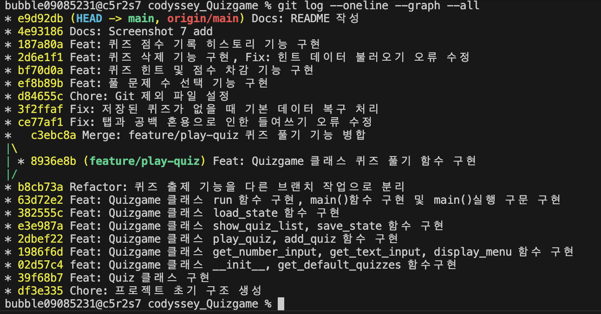

# 🎮 게임 상식 퀴즈 게임

Python 기본 문법과 객체 지향 프로그래밍, JSON 파일 입출력, Git을 학습하기 위해 제작한 콘솔 기반 퀴즈 게임입니다.

사용자는 게임과 관련된 퀴즈를 풀고 새로운 문제를 직접 등록할 수 있으며, 등록한 문제와 최고 점수는 `state.json` 파일에 저장됩니다.

프로그램을 종료한 후 다시 실행해도 이전에 추가한 퀴즈와 최고 점수를 불러올 수 있습니다.


## 📌 프로젝트 개요

- 프로젝트명: 게임 상식 퀴즈 게임
- 개발 언어: Python
- 실행 환경: Python 3.10 이상
- 프로그램 형태: 콘솔 프로그램
- 데이터 저장 방식: JSON
- 데이터 파일: `state.json`
- 외부 라이브러리: 사용하지 않음
- 사용한 표준 라이브러리
  - `json`
  - `os`
  - `random`

### 실행 환경



## 🎯 퀴즈 주제 및 선정 이유

퀴즈의 주제는 **게임 상식**으로 선정했습니다.

평소 게임에 관심이 많아 직접 문제를 만들기 쉽고, 다양한 게임과 게임 개발에 관련된 내용을 퀴즈로 구성할 수 있다고 생각하여 이 주제를 선택했습니다.

기본적으로 다음과 같은 게임 및 게임 개발 관련 문제가 포함되어 있습니다.

- 마인크래프트
- 리그 오브 레전드
- 언리얼 엔진
- 스타듀 밸리
- 젤다의 전설


## ▶️ 실행 방법

### 1. 저장소 복제

```bash
git clone <GitHub 저장소 URL>
```

### 2. 프로젝트 폴더로 이동

```bash
cd codyssey_Quizgame
```

### 3. Python 버전 확인

```bash
python3 --version
```

Python 3.10 이상을 사용합니다.

### 4. 프로그램 실행

```bash
python3 main.py
```

별도의 외부 라이브러리를 사용하지 않기 때문에 추가 패키지 설치는 필요하지 않습니다.


## 🕹️ 기능 목록

### 1. 퀴즈 풀기

저장되어 있는 퀴즈를 풀 수 있습니다.

- 저장된 퀴즈 출제
- 문제마다 4개의 선택지 출력
- 1~4 사이의 번호로 정답 입력
- 정답 및 오답 여부 출력
- 오답일 경우 실제 정답 출력
- 모든 문제 풀이 후 점수 계산
- 기존 최고 점수와 비교하여 최고 점수 갱신

추가로 Python의 `random` 모듈을 사용하여 퀴즈가 실행될 때마다 문제의 순서를 무작위로 섞도록 구현했습니다.


### 2. 퀴즈 추가

사용자가 새로운 퀴즈를 직접 등록할 수 있습니다.

입력 정보:

- 문제
- 선택지 4개
- 정답 번호 (1~4)

추가된 퀴즈는 즉시 `state.json`에 저장되기 때문에 프로그램을 종료한 후 다시 실행해도 유지됩니다.


### 3. 퀴즈 목록

현재 저장되어 있는 모든 퀴즈의 목록을 확인할 수 있습니다.

각 퀴즈의 번호와 문제 내용을 출력하며, 등록된 퀴즈가 없는 경우 별도의 안내 메시지를 출력합니다.


### 4. 점수 확인

지금까지 기록한 최고 점수를 확인할 수 있습니다.

최고 점수와 함께 다음 정보를 출력합니다.

- 최고 점수
- 당시 전체 문제 수
- 맞힌 문제 수

아직 퀴즈를 한 번도 풀지 않았다면 별도의 안내 메시지를 출력합니다.


### 5. 데이터 저장 및 불러오기

퀴즈 데이터와 최고 점수를 프로젝트 루트의 `state.json` 파일에 저장합니다.

프로그램 시작 시 기존 `state.json`을 읽어 이전 데이터를 복구합니다.

`state.json`이 존재하지 않는 첫 실행에서는 기본 퀴즈 데이터를 생성합니다.


### 6. 입력 예외 처리

잘못된 사용자 입력으로 프로그램이 비정상 종료되지 않도록 입력 검증 기능을 구현했습니다.

다음과 같은 입력을 처리합니다.

- 빈 입력
- 숫자가 아닌 입력
- 허용 범위를 벗어난 숫자
- 문제 또는 선택지의 빈 문자열

숫자 입력은 공통 입력 메서드를 통해 처리하여 중복 코드를 줄였습니다.


### 7. 안전한 프로그램 종료

프로그램 실행 중 다음 상황이 발생해도 가능한 데이터를 저장한 후 안전하게 종료하도록 구현했습니다.

- `KeyboardInterrupt` (`Ctrl+C`)
- `EOFError`

일반적인 메뉴 종료 시에도 데이터를 저장한 후 프로그램을 종료합니다.


### 8. 데이터 오류 복구

`state.json` 파일이 손상되었거나 정상적으로 읽을 수 없는 경우 예외 처리를 수행합니다.

다음과 같은 오류를 처리합니다.

- JSON 형식 오류
- 파일 읽기 오류
- 필요한 데이터의 오류

저장 데이터를 사용할 수 없는 경우 기본 퀴즈 데이터로 복구하여 프로그램을 계속 실행할 수 있도록 구현했습니다.

저장된 퀴즈 목록이 비어 있는 경우에도 기본 퀴즈 데이터를 불러오도록 처리했습니다.


## 📂 파일 구조

```text
codyssey_Quizgame/
├── main.py
├── state.json
├── README.md
└── .gitignore
```
프로그램에서는 다음과 같이 저장 파일의 경로를 지정했습니다.

```python
STATE_FILE = "state.json"
```

따라서 `main.py`를 프로젝트 루트에서 실행하면 `state.json`을 같은 프로젝트 루트에서 읽고 저장합니다.

### `main.py`

퀴즈 게임의 전체 Python 소스 코드입니다.

`Quiz` 클래스와 `QuizGame` 클래스를 포함하고 있습니다.


### `state.json`

퀴즈 목록과 최고 점수를 저장하는 데이터 파일입니다.

UTF-8 인코딩을 사용하며 JSON 형식으로 데이터를 관리합니다.


### `README.md`

프로젝트의 개요, 실행 방법, 주요 기능 및 데이터 구조 등을 설명하는 문서입니다.


### `.gitignore`

Git으로 관리할 필요가 없는 파일을 제외하기 위한 설정 파일입니다.


## 💾 state.json 데이터 설명

`state.json`은 프로젝트 루트에 생성되며 프로그램의 데이터를 영구적으로 저장하는 역할을 합니다.

기본적인 구조는 다음과 같습니다.

```json
{
    "quizzes": [
        {
            "question": "마인크래프트를 개발한 인물은 누구일까요?",
            "choices": [
                "게이브 뉴웰",
                "마르쿠스 페르손",
                "토비 폭스",
                "시드 마이어"
            ],
            "answer": 2
        }
    ],
    "best_score": 80,
    "best_correct": 4,
    "best_total": 5
}
```

각 필드의 역할은 다음과 같습니다.

| 필드 | 설명 |
|---|---|
| `quizzes` | 저장된 전체 퀴즈 목록 |
| `question` | 퀴즈 문제 |
| `choices` | 4개의 선택지 |
| `answer` | 정답 번호 (1~4) |
| `best_score` | 최고 점수 (100점 기준) |
| `best_correct` | 최고 점수 기록 당시 맞힌 문제 수 |
| `best_total` | 최고 점수 기록 당시 전체 문제 수 |


## 🧱 클래스 구조

### Quiz

퀴즈 한 문제를 표현하는 클래스입니다.

주요 속성:

- `question`: 문제
- `choices`: 선택지 목록
- `answer`: 정답 번호

주요 메서드:

- `display()`: 문제와 선택지를 출력
- `check_answer()`: 사용자가 입력한 답이 정답인지 확인
- `to_dict()`: 객체를 JSON 저장이 가능한 딕셔너리 형태로 변환


### QuizGame

퀴즈 게임 전체의 흐름과 데이터를 관리하는 클래스입니다.

주요 역할:

- 메뉴 출력
- 사용자 입력 처리
- 퀴즈 진행
- 퀴즈 추가
- 퀴즈 목록 출력
- 최고 점수 관리
- `state.json` 저장
- `state.json` 불러오기
- 예외 처리


## 🌿 Git 브랜치 활용

퀴즈 풀기 기능은 `main` 브랜치와 분리하여 별도의 기능 브랜치에서 작업했습니다.

사용한 브랜치:

```text
feature/play-quiz
```

브랜치를 생성한 후 퀴즈 출제 기능을 구현하고 커밋한 뒤 `main` 브랜치로 병합했습니다.

Git을 통해 기능 단위로 변경사항을 기록하고 브랜치를 이용하여 기능 개발 과정을 분리했습니다.


## 📝 Git 커밋 규칙

기능별로 변경사항을 구분하여 커밋했습니다.

주요 커밋 메시지 규칙은 다음과 같습니다.

| 종류 | 의미 | 예시 |
|---|---|---|
| `Feat` | 새로운 기능 구현 | `Feat: 퀴즈 추가 기능 구현` |
| `Fix` | 오류 또는 예외 상황 수정 | `Fix: 빈 퀴즈 데이터 복구 처리` |
| `Refactor` | 코드 구조 개선 | `Refactor: 퀴즈 출제 기능을 브랜치 작업으로 분리` |
| `Docs` | 문서 수정 | `Docs: README 작성` |


## 📸 실행 결과

### 메뉴 화면

 


### 퀴즈 풀기




### 퀴즈 추가




### 퀴즈 목록




### 최고 점수 확인



### 퀴즈 제거



### 종료




## 🔀 Git 작업 기록

최종 Git 커밋 및 브랜치 병합 기록은 다음 명령어를 통해 확인할 수 있습니다.

```bash
git log --oneline --graph --all
```




## 📚 프로젝트를 통해 학습한 내용

이 프로젝트를 구현하면서 다음 내용을 학습했습니다.

- Python 변수와 기본 자료형
- 조건문과 반복문
- 함수와 매개변수
- 클래스와 객체
- `__init__`과 `self`
- 리스트와 딕셔너리
- JSON 파일 저장 및 불러오기
- `try/except`를 이용한 예외 처리
- 사용자 입력 검증
- Git을 이용한 버전 관리
- 기능 단위 커밋
- Git 브랜치 생성 및 병합
- GitHub 원격 저장소 활용

## Git 복제 실습
